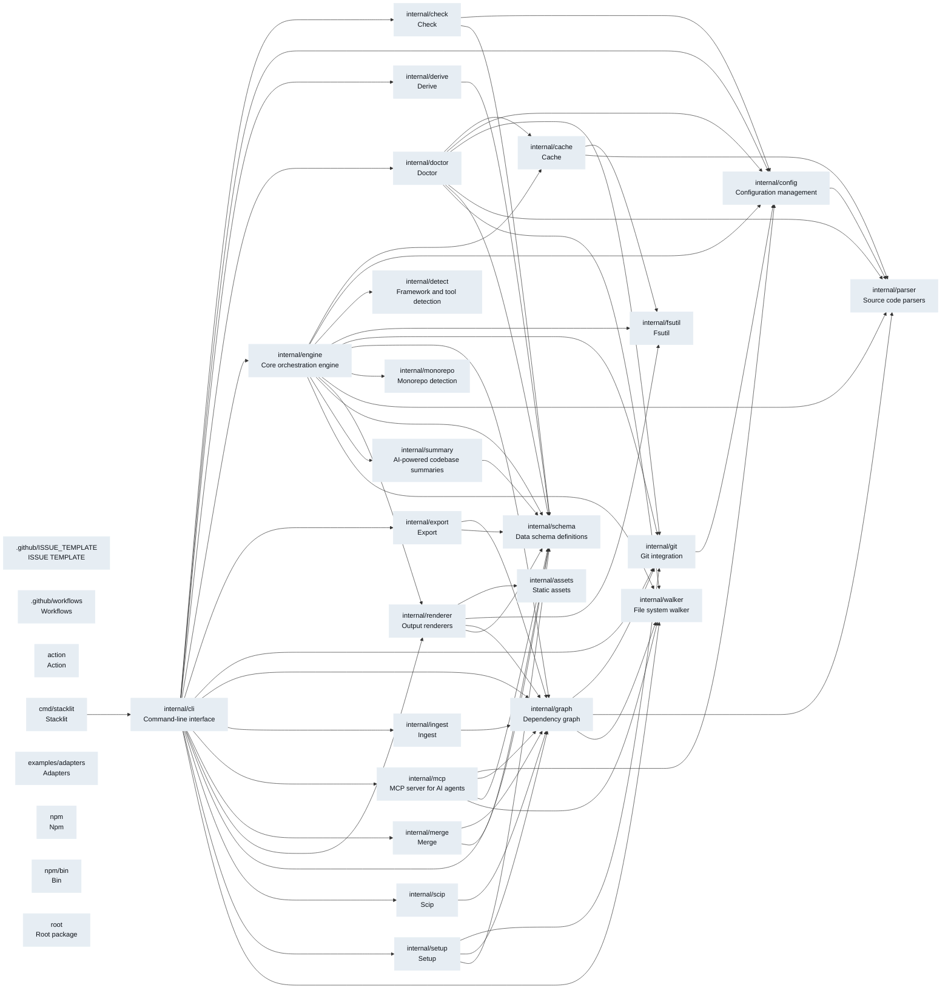

# stacklit dependency graph

> Generated by [stacklit](https://github.com/glincker/stacklit) on 2026-11-08. Run `stacklit generate` to update.

```mermaid
graph LR
  classDef c fill:#8b949e,color:#0d1117,stroke:#8b949e
  classDef cpp fill:#8b949e,color:#0d1117,stroke:#8b949e
  classDef csharp fill:#8b949e,color:#0d1117,stroke:#8b949e
  classDef elixir fill:#8b949e,color:#0d1117,stroke:#8b949e
  classDef go fill:#e6edf3,color:#0d1117,stroke:#e6edf3
  classDef java fill:#8b949e,color:#0d1117,stroke:#8b949e
  classDef javascript fill:#c9d1d9,color:#0d1117,stroke:#c9d1d9
  classDef kotlin fill:#8b949e,color:#0d1117,stroke:#8b949e
  classDef php fill:#8b949e,color:#0d1117,stroke:#8b949e
  classDef python fill:#b1bac4,color:#0d1117,stroke:#b1bac4
  classDef ruby fill:#8b949e,color:#0d1117,stroke:#8b949e
  classDef rust fill:#a5b3bf,color:#0d1117,stroke:#a5b3bf
  classDef scala fill:#8b949e,color:#0d1117,stroke:#8b949e
  classDef swift fill:#8b949e,color:#0d1117,stroke:#8b949e
  classDef typescript fill:#c9d1d9,color:#0d1117,stroke:#c9d1d9
  github_ISSUE_TEMPLATE[".github/ISSUE_TEMPLATE<br/>ISSUE TEMPLATE"]:::go
  github_workflows[".github/workflows<br/>Workflows"]:::go
  action["action<br/>Action"]:::go
  cmd_stacklit["cmd/stacklit<br/>Stacklit"]:::go
  examples_adapters["examples/adapters<br/>Adapters"]:::go
  internal_assets["internal/assets<br/>Static assets"]:::go
  internal_cache["internal/cache<br/>Cache"]:::go
  internal_check["internal/check<br/>Check"]:::go
  internal_cli["internal/cli<br/>Command-line interface"]:::go
  internal_config["internal/config<br/>Configuration management"]:::go
  internal_derive["internal/derive<br/>Derive"]:::go
  internal_detect["internal/detect<br/>Framework and tool detection"]:::go
  internal_doctor["internal/doctor<br/>Doctor"]:::go
  internal_engine["internal/engine<br/>Core orchestration engine"]:::go
  internal_export["internal/export<br/>Export"]:::go
  internal_fsutil["internal/fsutil<br/>Fsutil"]:::go
  internal_git["internal/git<br/>Git integration"]:::go
  internal_graph["internal/graph<br/>Dependency graph"]:::go
  internal_ingest["internal/ingest<br/>Ingest"]:::go
  internal_mcp["internal/mcp<br/>MCP server for AI agents"]:::go
  internal_merge["internal/merge<br/>Merge"]:::go
  internal_monorepo["internal/monorepo<br/>Monorepo detection"]:::go
  internal_parser["internal/parser<br/>Source code parsers"]:::go
  internal_renderer["internal/renderer<br/>Output renderers"]:::go
  internal_schema["internal/schema<br/>Data schema definitions"]:::go
  internal_scip["internal/scip<br/>Scip"]:::go
  internal_setup["internal/setup<br/>Setup"]:::go
  internal_summary["internal/summary<br/>AI-powered codebase summaries"]:::go
  internal_walker["internal/walker<br/>File system walker"]:::go
  npm["npm<br/>Npm"]:::go
  npm_bin["npm/bin<br/>Bin"]:::go
  root["root<br/>Root package"]:::go
  cmd_stacklit --> internal_cli
  internal_cache --> internal_fsutil
  internal_cache --> internal_parser
  internal_check --> internal_config
  internal_check --> internal_schema
  internal_cli --> internal_check
  internal_cli --> internal_config
  internal_cli --> internal_derive
  internal_cli --> internal_doctor
  internal_cli --> internal_engine
  internal_cli --> internal_export
  internal_cli --> internal_git
  internal_cli --> internal_graph
  internal_cli --> internal_ingest
  internal_cli --> internal_mcp
  internal_cli --> internal_merge
  internal_cli --> internal_renderer
  internal_cli --> internal_schema
  internal_cli --> internal_scip
  internal_cli --> internal_setup
  internal_cli --> internal_walker
  internal_config --> internal_parser
  internal_derive --> internal_schema
  internal_doctor --> internal_cache
  internal_doctor --> internal_config
  internal_doctor --> internal_git
  internal_doctor --> internal_parser
  internal_doctor --> internal_schema
  internal_doctor --> internal_walker
  internal_engine --> internal_cache
  internal_engine --> internal_config
  internal_engine --> internal_detect
  internal_engine --> internal_fsutil
  internal_engine --> internal_git
  internal_engine --> internal_graph
  internal_engine --> internal_monorepo
  internal_engine --> internal_parser
  internal_engine --> internal_renderer
  internal_engine --> internal_schema
  internal_engine --> internal_summary
  internal_engine --> internal_walker
  internal_export --> internal_graph
  internal_export --> internal_schema
  internal_git --> internal_config
  internal_graph --> internal_git
  internal_graph --> internal_parser
  internal_graph --> internal_walker
  internal_ingest --> internal_graph
  internal_mcp --> internal_config
  internal_mcp --> internal_graph
  internal_mcp --> internal_schema
  internal_mcp --> internal_walker
  internal_merge --> internal_graph
  internal_merge --> internal_schema
  internal_renderer --> internal_assets
  internal_renderer --> internal_fsutil
  internal_renderer --> internal_graph
  internal_renderer --> internal_schema
  internal_scip --> internal_graph
  internal_setup --> internal_git
  internal_setup --> internal_graph
  internal_setup --> internal_schema
  internal_summary --> internal_schema
```
